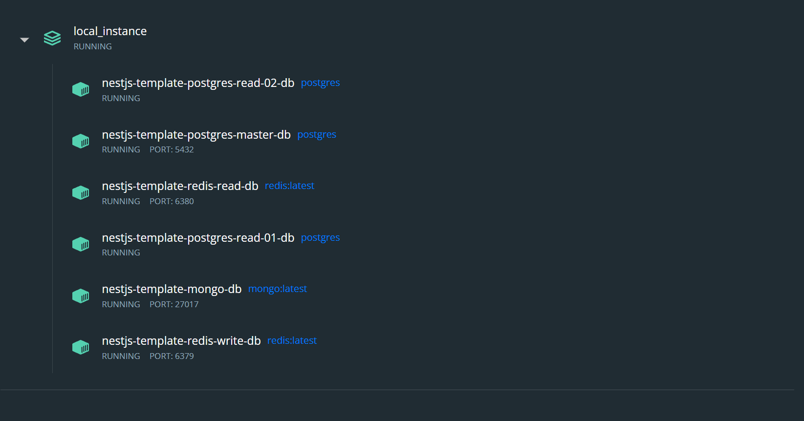

## Installation

```bash
$ yarn install
```


## Run Project with Docker

스크립트 실행 전 아래 도커 인스턴스를 설치를 확인 해 주세요.

1. [Docker](https://docs.docker.com)
2. [Docker-Compose](https://docs.docker.com/compose/)

```bash
$ docker-compose -p local_instance up -d
```

해당 프로젝트에 실행에 필요한 외부 참조 인스턴스를 설치 합니다.
1. Postgresql ( Read / Write)
    - 이미지 빌드 작업 과 함께 [init.sql](init.sql) 스크립트가 실행 됩니다.
2. MongoDB
3. Redis ( Read / Write )



## Running the apps

```bash
# local
$ nest start

# local watch mode
$ nest start:local
```

## Reference


- `Modules`
  - [AWS DynamoDB](doc/md/modules/aws_dynamo.md) 
  - [AWS SQS](doc/md/modules/aws_sqs.md) 
  - [AWS S3](doc/md/modules/aws_s3.md) 
  - [FCM](doc/md/modules/fcm.md) 
  - [Postgresql](doc/md/modules/pg.md)
- `Common`
  - [Auth](doc/md/common/auth.md)
  - [Cache](doc/md/common/cache.md)
  - [Enum](doc/md/common/enum.md)
  - [File](doc/md/common/file.md)
  - [Job](doc/md/common/job.md)
  - [Logger](doc/md/common/logger.md)
  - [Request](doc/md/common/request.md)
  - [Response](doc/md/common/response.md)
  

