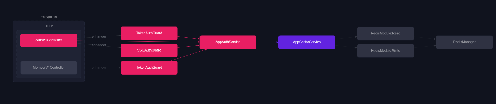

# AppAuthModule

해당 모듈은 Global 전역 으로 지정 되어 있으며 `AppCacheModule` 을 참조 하고 있습니다. 

`AppCacheModule` 에서는 `Redis` Service Provider 를 반환 합니다.
```ts
import { Global, Module } from '@nestjs/common';
import { AppAuthService } from './service/app-auth.service';
import { AppCacheModule } from '../app-cache/app-cache.module';

@Global()
@Module({
  imports: [AppCacheModule],
  providers: [AppAuthService],
  exports: [AppAuthService]
})
export class AppAuthModule {}
```




### Folder Structure

1. `/constant` 인증 전략 MetaData `Key` 상수 모음 입니다.
2. `/decorator` 인증 데코레이터 모음 입니다. (`applyDecorators` 함수를 사용하여 여러 데코레이터들을 하나의 데코레이터로 결합하여 사용 하고 있습니다.)
3. `/guard` 인증 데코레이터의 실행 구현 로직이 포함 되어 있습니다.
4. `/interceptor` Request 요청 시 인가 처리된 사용자의 계정 활성화 시간(ttl) 연장 처리하는 미들 웨어 입니다.
5. `/service` 토큰 관리에 필요한 헬퍼 클레스 입니다.


#
#
#

