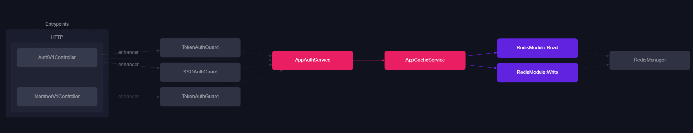

# AppCacheModule

해당 모듈은 `AppAuthModule` 으로 반환 되고 있으며

 Redis 마스터 서버에 쓰기 작업과 읽기 작업을 분리하여 Service Provider 를 반환 합니다.
 
`RedisReplicaCode` 코드 정의와 `AppCacheService` 서비스 구현부를 유형의 맞게 재 작성 합니다.
```ts
import { Module } from '@nestjs/common';
import { AppCacheService } from './service/app-cache.service';
import { RedisModule } from '@liaoliaots/nestjs-redis';
import { RedisReplicaCode } from '../app-enum/redis/redis-replica.code.enum';

@Module({
  imports:[
    RedisModule.forRoot({
      config: [
        {
          namespace: RedisReplicaCode.Read.code,
          host: 'localhost',
          port: 6380,
          db: 0
        },
        {
          namespace: RedisReplicaCode.Write.code,
          host: 'localhost',
          port: 6379,
          db: 0
        }
      ]
    })
  ],
  providers: [AppCacheService],
  exports: [AppCacheService]
})
export class AppCacheModule {}

// 또는 동적으로 config 설정 시 

RedisModule.forRootAsync({
  inject: [ConfigService],
  useFactory: async (config: ConfigService) => ({
    config: [
      {
        namespace: RedisReplicaCode.Read.code,
        host: config.get<string>('cache.redis.read.host'),
        port: config.get<number>('cache.redis.read.host'),
        db: config.get<number>('cache.redis.read.db'),
      },
      {
        namespace: RedisReplicaCode.Write.code,
        host: config.get<string>('cache.redis.write.host'),
        port: config.get<number>('cache.redis.write.host'),
        db: config.get<number>('cache.redis.write.db'),
      },
    ]
  })
})


```




### Folder Structure

1. `/service` Redis 서비스 구현 로직을 구성 합니다.

#
#
#

