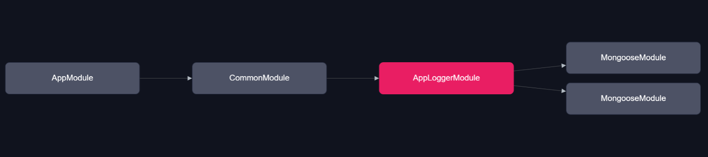
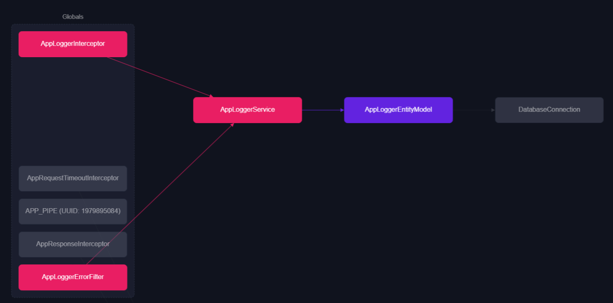

# AppLogger

1. 해당 모듈은 로그를 생성 하기 위한 전역 설정 미들웨어 집합 입니다.
2. 데이터 기록을 위해 `MongoDB` 를 사용 하고 있으며 `Mongoose` ODM 기본 참조 양식를 따르고 있습니다.

1. `AppLoggerInterceptor` 수신/응답 처리 하는 미들웨어
2. `AppLoggerErrorFilter` 예외 처리 하는 미들웨어
3. `AppLoggerService` 로그 데이터 생성 

### Folder Structure

1. `/constant` 로그 상태 상수 값
2. `/entity` Mongoose ODM 테이블 스키마 
3. `/filter` 예외 처리 미들웨어
4. `/interceptor` 응답/수신 미들웨어
5. `/interface` 로그 타입 정의
6. `/service` 로그 처리 정의
