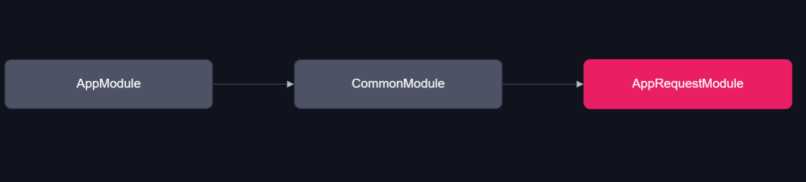
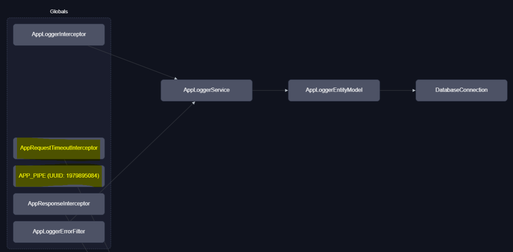

# AppRequestModule

1. 요청 데이터의 `헤더 변경`, `유효성 검사`, `타임아웃`  처리 전역 미들웨어 집합니다.

1. `AppRequestTimeoutInterceptor` 타임아웃 처리 미들웨어
2. `APP_PIPE` ValidationPipe 미들웨어

### Folder Structure

1. `/interceptor`
2. `/interface`
3. `/middleware`
