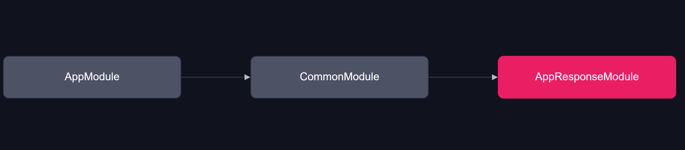

# AppResponseModule

1. 응답 처리 전역 미들웨어 집합니다.




1. `AppResponseInterceptor` 전역 응답 처리 미들웨어
2. `AppResponseSerializeInterceptor` 사용자 지정 응답 처리 미들웨어
   1. 사용자 지정 응답 처리 시 `AppResponseSerialize({DTO-Class})` 데코레이터를 참조 합니다.
   2. DTO 클래스 프로퍼티 중  `@Expose()` 참조된 정보만 반환 합니다. 
   ```ts
    // member.res.dto.ts
    export class MemberV1ProfileRes {
      @Expose()
      user_id: string;
    
      @Expose()
      email: string;
    }
    
    // member-admin.controller.ts
    @Controller({ path: 'member', version: '1' })
    @TokenAuth(ACCESS_TOKEN)
    export class MemberAdminController {
      constructor(private readonly memberService: MemberService) {}
    
      @Get('/profile')
      @AppResponseSerialize(MemberV1ProfileRes)
      public async profile(@Req() { _id }: AppRequest) {
        return await this.memberService.findById(_id);
      }
    }
    ```

### Folder Structure


1. `/decorator`
2. `/interceptor`
3. `/interface`
